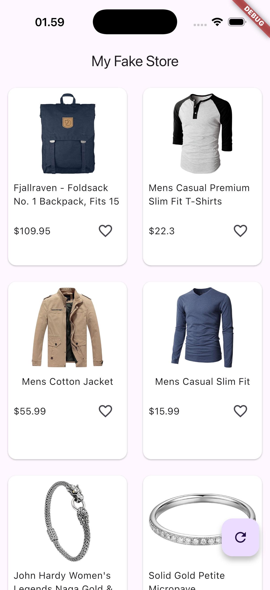

# 🛍️ Fake Store App

A simple **Flutter e-commerce app** that fetches products from [Fake Store API](https://fakestoreapi.com) and displays them in a modern grid layout.
This project demonstrates **basic API integration**, **async data fetching**, and **responsive UI** in Flutter.

---

## 🚀 Features

* Fetch and display product list from API
* Responsive grid view layout
* Product image, title, and price display
* Simple state management with `FutureBuilder`
* Loading and empty state handling

---

## 📸 App Preview

Here’s how the app looks:



---

## ⚙️ Tech Stack

* **Flutter** (Dart)
* **HTTP package** for API calls
* **Material 3** design system

---

## 🧩 Project Structure

```
lib/
 ├── constant/
 │   └── constant.dart       # Base URL and API constants
 ├── screens/
 │   └── home_screen.dart    # Main screen that displays product grid
 └── main.dart               # App entry point
```

---

## 🧠 Learnings

* How to integrate REST API in Flutter
* How to use `FutureBuilder` for async UI
* How to build grid-based product layouts

---

## ▶️ Getting Started

To run this project locally:

```bash
# Clone this repository
git clone https://github.com/faldi17/fake-store.git

# Move into the project directory
cd fake-store

# Get dependencies
flutter pub get

# Run the app
flutter run
```

---

## 🌐 API Reference

Data powered by [Fake Store API](https://fakestoreapi.com)

Base URL:

```dart
const kBaseUrl = "https://fakestoreapi.com";
const kProductUrl = "$kBaseUrl/products";
```
